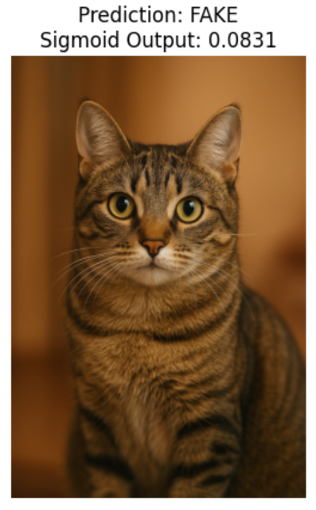

# CIFAKE Real vs AI-Generated Image Classification

Repository ini berisi proyek **klasifikasi citra** untuk membedakan **gambar asli (real)** dan **gambar hasil generasi AI (fake)** menggunakan arsitektur **ResNet101**.  Model dilatih dan diuji menggunakan dataset **CIFAKE** dengan pendekatan *deep learning*.

## 📂 Dataset

Dataset yang digunakan adalah **CIFAKE: Real and AI-Generated Synthetic Images**. 
- Kaggle: https://www.kaggle.com/datasets/birdy654/cifake-real-and-ai-generated-synthetic-images 
- Jumlah data: ±120.000 gambar  
- Kelas:
  - **REAL**: gambar asli dari dataset CIFAR-10  
  - **FAKE**: gambar sintetis hasil generasi AI

## Contoh Dataset

### Gambar Asli (REAL)
.jpg)

### Gambar AI-Generated (FAKE)
.jpg)

## 📊 Hasil Klasifikasi

Model yang telah dilatih mampu membedakan gambar asli dan gambar hasil generasi AI dengan baik.

